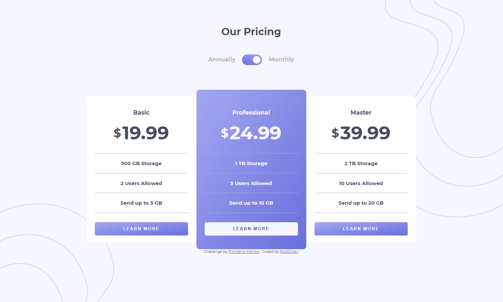

# Frontend Mentor - Pricing component with toggle solution

This is a solution to the [Pricing component with toggle challenge on Frontend Mentor](https://www.frontendmentor.io/challenges/pricing-component-with-toggle-8vPwRMIC). Frontend Mentor challenges help you improve your coding skills by building realistic projects. 

## Table of contents

- [Overview](#overview)
  - [The challenge](#the-challenge)
  - [Screenshot](#screenshot)
  - [Links](#links)
  - [Built with](#built-with)
  - [What I learned](#what-i-learned)
- [Author](#author)


## Overview

### The challenge

Users should be able to:

- View the optimal layout for the component depending on their device's screen size
- Control the toggle with both their mouse/trackpad and their keyboard
- **Bonus**: Complete the challenge with just HTML and CSS

### Screenshot




### Links

- Solution URL: [Add solution URL here](https://your-solution-url.com)
- Live Site URL: [Add live site URL here](https://your-live-site-url.com)


### Built with

- Semantic HTML5 markup
- SASS
- Flexbox
- Javascript
- Desktop-first workflow

### What I learned

Use this section to recap over some of your major learnings while working through this project. Writing these out and providing code samples of areas you want to highlight is a great way to reinforce your own knowledge.

To see how you can add code snippets, see below:


<h1>Some Javascipt code I'm proud of</h1>

```js
function switchPrice() {
  let monthlyPriceBasic = document.getElementById("monthly-price-basic");
  let monthlyPriceProfessional = document.getElementById(
    "monthly-price-professional"
  );
  let monthlyPriceMaster = document.getElementById("monthly-price-master");
  let switchButton = document.getElementById("switch");
  if (switchButton.checked == true) {
    monthlyPriceBasic.innerHTML = "199.99";
    monthlyPriceProfessional.innerHTML = "249.99";
    monthlyPriceMaster.innerHTML = "399.99";
  } else if (switchButton.checked == false) {
    monthlyPriceBasic.innerHTML = "19.99";
    monthlyPriceProfessional.innerHTML = "24.99";
    monthlyPriceMaster.innerHTML = "39.99";
  }
}
```


## Author

- Github - [Neddinev](https://github.com/NedDinev)
- Frontend Mentor - [@neddinev](https://www.frontendmentor.io/profile/NedDinev)
- Instagram - [@neddinev](https://www.instagram.com/neddinev/)
